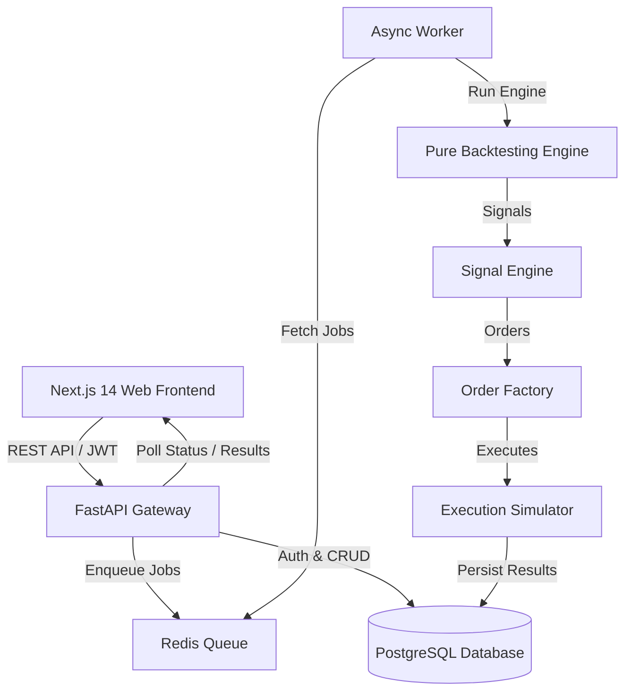

# Bison – Production-Grade Indian Algorithmic Trading Platform

[](https://github.com/yuyutsu01/Bison/actions)
[](LICENSE)
[](https://www.python.org/downloads/)
[](https://nextjs.org/)

**Bison** is a production-grade algorithmic trading platform built specifically for Indian market traders (NIFTY, BANKNIFTY, and NSE/BSE Equities). It provides an extensible, event-driven, zero look-ahead bias backtesting engine paired with a modern visual rule builder, order & execution simulator, and quantitative analytics dashboard.

---

##  Key Features & Iterations Completed

### Implemented Iterations (0 through 5)
1. **Iteration 0 (Foundation)**: Monorepo infrastructure, Next.js frontend, FastAPI backend, PostgreSQL, Redis, worker infrastructure, Docker Compose, CI pipeline.
2. **Iteration 1 (Instruments & Market Data)**: Instrument model, NSE instruments, NIFTY/BANKNIFTY fixtures, CSV ingestion, data validation, missing candle detection, OHLCV normalization.
3. **Iteration 2 (Strategy DSL)**: Formal JSON strategy specification schema, entry/exit condition tree, Pydantic validation models.
4. **Iteration 3 (Indicator Engine)**: SMA, EMA, RSI, MACD, Bollinger Bands, ATR calculations with warm-up protection and numerical tests.
5. **Iteration 4 (Signal Engine)**: Deterministic signal generation (`BUY`, `SELL`, `EXIT`), logical condition tree evaluation (`AND`, `OR`, `NOT`), and crossover detection.
6. **Iteration 5 (Order & Execution Simulator)**: Strongly typed Order domain, state machine lifecycle (`CREATED` -> `PENDING` -> `FILLED`), `NEXT_BAR_OPEN` execution policy, slippage models (`Zero`, `FixedPoints`, `Percentage`), tick size normalization, idempotency protection, and REST API endpoints.

---

##  System Architecture



---

## Quick Start (Local Setup)

### Prerequisites
- Docker & Docker Compose
- Node.js 18+ & Python 3.11+ (if running without Docker)

### Running via Docker Compose
```bash
# 1. Clone repository
git clone https://github.com/yuyutsu01/Bison.git
cd Bison

# 2. Setup environment variables
cp .env.example .env

# 3. Launch full stack (PostgreSQL, Redis, Backend, Worker, Web)
docker-compose up --build
```

Access services:
- **Web App**: `http://localhost:3000`
- **FastAPI OpenAPI Docs**: `http://localhost:8000/docs`

---

## Local Development Commands

```bash
pytest apps/api/tests     # Run backend pytest suite (31 tests)
```

---

## Repository Structure

```text
Bison/
├── apps/
│   ├── api/            # FastAPI Python backend & backtesting engine
│   └── web/            # Next.js 14 TypeScript web frontend
├── docs/               # System architecture, iterations & decision records
├── data/               # Deterministic test fixtures & sample market data
├── infra/              # Dockerfiles & container configurations
├── docker-compose.yml
└── README.md
```

---

## Disclaimer

This platform is intended exclusively for educational, research, and backtesting purposes. Historical performance does not guarantee future results. Algorithmic trading involves substantial risk of loss. Always perform thorough risk management before deploying real capital.
