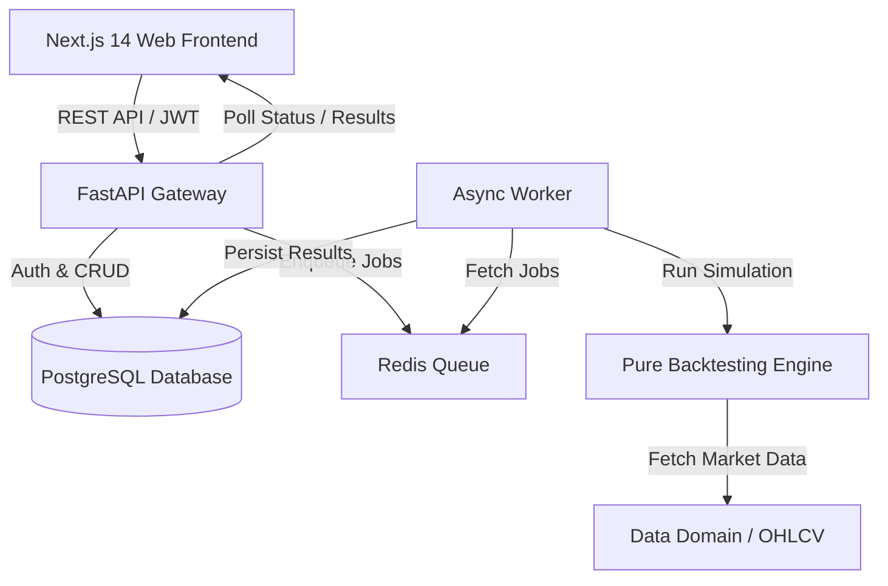

# Bison – Production-Grade Indian Algorithmic Trading Platform

[](https://github.com/yuyutsu01/Bison/actions)
[](LICENSE)
[](https://www.python.org/downloads/)
[](https://nextjs.org/)

**Bison** is a production-grade algorithmic trading platform built specifically for Indian market traders (NIFTY, BANKNIFTY, and NSE/BSE Equities). It provides an extensible, event-driven, zero look-ahead bias backtesting engine paired with a modern visual rule builder and quantitative analytics dashboard.

---

## 🌟 Key Features

### Implemented (Iteration 1 Scope)
1. **Visual Rule-Based Strategy Builder**: Interactive canvas (Next.js 14 + React Flow) for constructing entry, exit, indicator, and risk management rules without code.
2. **Strict Zero Look-Ahead Bias Engine**: Bar $t$ signals execute strictly on bar $t+1$'s Open price, eliminating future data leakage.
3. **Indian Market Microstructure Costs**: Accurate cost modeling for Indian markets including Brokerage, STT, Exchange fees, SEBI charges, GST (18%), Stamp Duty, and Slippage.
4. **Formal Strategy DSL**: Typed, versioned, and validated JSON strategy definition schema.
5. **Asynchronous Backtest Queue**: Backtests execute via background job workers with live progress updates.
6. **Quantitative Analytics Dashboard**: Financial performance cards (Sharpe, CAGR, Max Drawdown, Win Rate, Profit Factor), interactive Recharts equity curve, drawdown chart, and candlestick chart with trade execution markers.
7. **Trade Inspector**: Deep-dive into individual executed trades to understand entry/exit signals, indicator states, holding duration, and cost breakdowns.
8. **Strategy Versioning & Comparison**: Immutable strategy versioning with side-by-side performance comparison.
9. **Export Engine**: Export full backtest metrics, trade logs, and strategy definitions in CSV/JSON formats.

### Planned (Future Iterations)
- **Iteration 2**: Paper Trading & Broker Integration (Zerodha, Angel One, Dhan).
- **Iteration 3**: Advanced Options Trading & Multi-Leg Option Strategies.
- **Iteration 4**: Live Order Execution & Real-Time Risk Engine.
- **Iteration 5**: Advanced Portfolio Management & Multi-Asset Optimization.
- **Iteration 6**: Machine Learning / Reinforcement Learning Strategy Plugins.

---

## 🏛️ System Architecture



---

## 🚀 Quick Start (Local Setup)

### Prerequisites
- Docker & Docker Compose
- Node.js 18+ & Python 3.11+ (if running without Docker)

### Running via Docker Compose
```bash
# 1. Clone repository
git clone https://github.com/yuyutsu01/Bison.git
cd Bison

# 2. Setup environment variables
cp .env.example .env

# 3. Launch full stack (PostgreSQL, Redis, Backend, Worker, Web)
docker-compose up --build
```

Access services:
- **Web App**: `http://localhost:3000`
- **FastAPI OpenAPI Docs**: `http://localhost:8000/docs`

---

## 💻 Local Development Commands

Using `make`:

```bash
make setup    # Install backend and frontend dependencies
make dev      # Run local dev servers (API + Web)
make test     # Run all unit and integration tests
make lint     # Run code formatters and linters
make format   # Automatically format codebase
```

---

## 📁 Repository Structure

```text
Bison/
├── apps/
│   ├── api/            # FastAPI Python backend & backtesting engine
│   └── web/            # Next.js 14 TypeScript web frontend
├── docs/               # System architecture & decision records
├── data/               # Deterministic test fixtures & sample market data
├── infra/              # Dockerfiles & container configurations
├── docker-compose.yml
├── Makefile
└── README.md
```

---

## ⚠️ Disclaimer

This platform is intended exclusively for educational, research, and backtesting purposes. Historical performance does not guarantee future results. Algorithmic trading involves substantial risk of loss. Always perform thorough risk management before deploying real capital.
