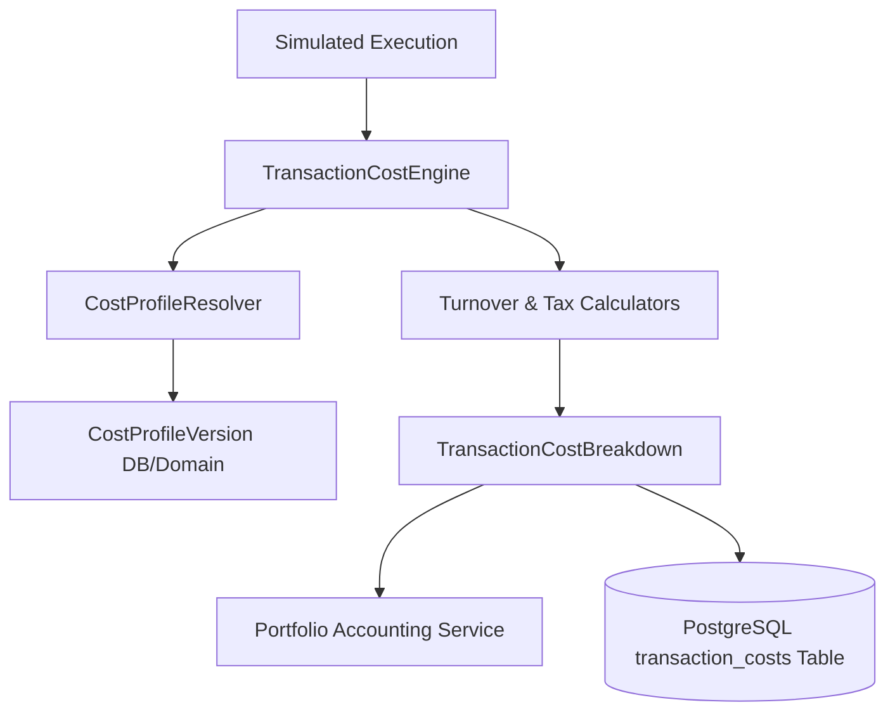

# Bison Architecture — Indian Transaction Cost & Cost Engine (Iteration 7)

## Overview

In algorithmic trading, backtests conducted without realistic transaction costs present a flawed illusion of profitability. The **Bison Indian Transaction Cost Engine** implements a modular, versioned, and effective-dated fee and tax calculator specifically designed for Indian stock exchanges (NSE / BSE).

Every fill generated by the Execution Simulator is routed through the `TransactionCostEngine` before portfolio state mutation. The calculated cost breakdown is itemized, saved to PostgreSQL, and deducted from portfolio cash and net realized P&L.

---

## 1. Architectural Principles & Isolation

1. **Strict Decoupling**: Cost profiles and tax rate formulas are strictly decoupled from Portfolio state management and Strategy DSL logic.
2. **Versioned & Effective-Dated**: Tax rates change over time (e.g., STT, SEBI fee revisions). Cost profiles contain versioned ranges (`effective_from` <= `timestamp` <= `effective_to`).
3. **Decimal Precision**: All turnover and statutory fee computations use Python's `Decimal` type to eliminate binary floating-point rounding errors.
4. **Rounding Policy**: Centralized `FinancialRoundingPolicy` uses `ROUND_HALF_UP` to round every itemized component to 2 decimal places (PAISA level).

---

## 2. Tax & Statutory Fee Formulas

### A. Turnover
$$\text{Turnover} = \text{Price} \times \text{Quantity}$$

### B. Brokerage
Supported models:
- **`PERCENTAGE_WITH_CAP`**: $\min(\text{Turnover} \times \text{rate}, \text{cap})$ (e.g. 0.03% capped at ₹20 per order).
- **`FLAT_PER_ORDER`**: Flat fee per executed order (e.g. ₹20).
- **`PERCENTAGE`**: Uncapped percentage fee.

### C. Securities Transaction Tax (STT)
- **BUY Side**: 0% for intraday equity segment.
- **SELL Side**: 0.025% on turnover for intraday equity segment.

### D. Exchange Turnover Charges
- **NSE Equity Intraday Rate**: 0.00345% of turnover.

### E. SEBI Turnover Fees
- **SEBI Regulatory Fee Rate**: ₹10 per crore (0.0001% of turnover).

### F. Stamp Duty
- **BUY Side**: 0.003% of turnover (payable by buyers only in Indian equity spot markets).
- **SELL Side**: 0.000%.

### G. Goods & Services Tax (GST)
GST (18%) applies strictly to the **Taxable Base**:
$$\text{Taxable Base} = \text{Brokerage} + \text{Exchange Charges} + \text{SEBI Fees}$$
$$\text{GST} = \text{Taxable Base} \times 0.18$$

> **Critical Rule**: STT and Stamp Duty are legally excluded from the GST taxable base.

---

## 3. Financial Net Cash & P&L Accounting

When an execution fills:
1. **BUY Fills**:
   $$\text{Cash Outflow} = (\text{Quantity} \times \text{Execution Price}) + \text{Total Cost}$$
2. **SELL Fills**:
   $$\text{Cash Inflow} = (\text{Quantity} \times \text{Execution Price}) - \text{Total Cost}$$
3. **Net Realized P&L**:
   $$\text{Net Realized PnL} = \text{Gross Realized PnL} - \text{Total Costs}$$

---

## 4. Entity Relationship & Data Flow

